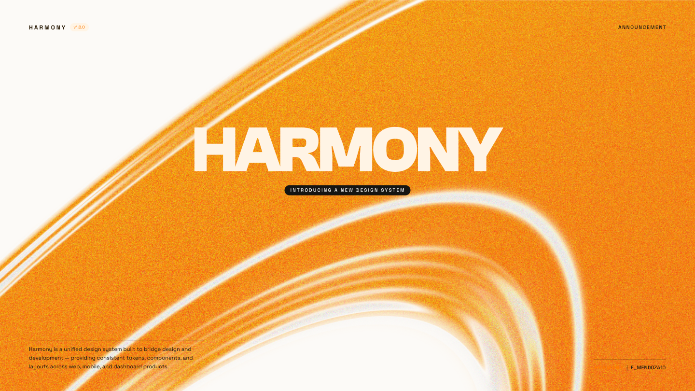

<p align="center">
  
</p>

<p align="center">
  
  
  
  
</p>

# Harmony Design System

A unified design system built to bridge design and development — providing
consistent tokens, components, and layouts across web, mobile, and dashboard
products. Big editorial titles, organised layouts, and effortless readability.

<p align="center">
  <a href="#components"><strong>Components</strong></a>&nbsp;&nbsp;&nbsp;
  <a href="#3-token-flow--the-one-rule"><strong>Tokens</strong></a>&nbsp;&nbsp;&nbsp;
  <a href="#9-figma-mcp-integration"><strong>Figma</strong></a>&nbsp;&nbsp;&nbsp;
  <a href="#11-typography-scale"><strong>Typography</strong></a>&nbsp;&nbsp;&nbsp;
  <a href="#12-colour-palette"><strong>Colour</strong></a>&nbsp;&nbsp;&nbsp;
  <a href="#13-dark-mode"><strong>Dark Mode</strong></a>
</p>

---

### Components

<table>
<tr>
<td>

**UI**&nbsp;&nbsp;
[](components/specs/)
[](components/specs/)
[](components/specs/)
[](components/specs/)
[](components/specs/)
[](components/specs/)
[](components/specs/)

</td>
</tr>
<tr>
<td>

**Layout**&nbsp;&nbsp;
[](components/specs/)
[](components/specs/)
[](components/specs/)
[](components/specs/)
[](components/specs/)

</td>
</tr>
<tr>
<td>

**Navigation**&nbsp;&nbsp;
[](components/specs/navigation.md)
[](components/specs/navigation.md)
[](components/specs/navigation.md)
[](components/specs/)
[](components/specs/footer.md)

</td>
</tr>
<tr>
<td>

**Content**&nbsp;&nbsp;
[](components/specs/hero.md)
[](components/specs/service-card.md)
[](components/specs/project-grid.md)
[](components/specs/article.md)
[](components/specs/bio-section.md)
[](components/specs/)

</td>
</tr>
<tr>
<td>

**Media**&nbsp;&nbsp;
[](components/specs/media.md)
[](components/specs/media.md)
[](components/specs/media.md)
[](components/specs/slider.md)
[](components/specs/media.md)

</td>
</tr>
<tr>
<td>

**Interaction**&nbsp;&nbsp;
[](components/specs/transitions.md)
[](components/specs/transitions.md)
[](components/specs/slider.md)
[](components/specs/transitions.md)
[](components/specs/transitions.md)

</td>
</tr>
<tr>
<td>

**Forms**&nbsp;&nbsp;
[](components/specs/)
[](components/specs/)
[](components/specs/)
[](components/specs/)
[](components/specs/)

</td>
</tr>
</table>

<br />

> **Agents (Devin / Cascade):** load `CONTEXT.md` first every session. It is the
> routing index that tells you which file to retrieve for which task.

---

## Table of Contents

1. [Repo structure](#1-repo-structure)
2. [Documentation map](#2-documentation-map)
3. [Token flow — the one rule](#3-token-flow--the-one-rule)
4. [The 3 entry points — edit order](#4-the-3-entry-points--edit-order)
5. [Entry A: update a design principle](#5-entry-a-update-a-design-principle)
6. [Entry B: update a token value](#6-entry-b-update-a-token-value)
7. [Entry C: new primitives from Figma](#7-entry-c-new-primitives-from-figma)
8. [Build a component](#8-build-a-component)
9. [Figma MCP integration](#9-figma-mcp-integration)
10. [Using the foundation in a project](#10-using-the-foundation-in-a-project)
11. [Typography scale](#11-typography-scale)
12. [Colour palette](#12-colour-palette)
13. [Dark mode](#13-dark-mode)
14. [Files never edited manually](#14-files-never-edited-manually)
15. [Verification checklist](#15-verification-checklist)
16. [Quick reference](#16-quick-reference)

---

## 1. Repo structure

```
Harmony/
├── README.md                    ← you are here — master guide
├── CONTEXT.md                   ← routing index for agents (load first)
├── AGENTS.md                    ← full agent operating guide
├── SKILL.md                     ← Figma Make / MCP generation skill
│
├── tokens/
│   ├── primitives.json          ← Figma colour export — immutable, never invent values
│   ├── semantic.json            ← intent aliases + typography / spacing / radius / shadow
│   └── components.json          ← component-scoped aliases (reference semantic only)
│
├── foundations/
│   ├── theme.css                ← GENERATED — never hand-edit
│   └── reset.css                ← base / reset layer
│
├── docs/
│   ├── DESIGN.md                ← design-language foundation (brand, principles, style)
│   ├── WORKFLOWS.md             ← exact prompts to paste into Devin / Cascade
│   └── FIGMA-CONFIG.md          ← Figma file structure and Code Connect rules
│
├── .devin/
│   ├── rules/                   ← always-on agent constraints
│   │   ├── harmony-core.md
│   │   ├── tokens.md
│   │   ├── figma-mcp.md
│   │   ├── dependencies.md
│   │   └── accessibility.md
│   └── skills/                  ← step-by-step procedures (skill-based)
│       ├── design-language-sync/SKILL.md
│       ├── docs-sync/SKILL.md
│       ├── design-to-token/SKILL.md
│       ├── component-build/SKILL.md
│       └── code-connect/SKILL.md
│
├── components/                  ← framework-agnostic specs + Code Connect
│   ├── specs/                   ← component spec docs (per-component .md)
│   └── README.md                ← component library architecture + Figma mapping
│
├── assets/
│   ├── backgrounds/             ← liquid chrome hero textures (brand visual identity)
│   ├── brand/                   ← Harmony logo marks
│   └── presentations/           ← Figma cover exports and hero screenshots
│
├── prompts/                     ← Figma Make prompt templates (e.g. agency template)
│
└── packages/                    ← monorepo: web (Next.js) + mobile (Expo/RN)
    ├── web/                     ← Next.js 15 + Tailwind v4 + Harmony foundations
    └── mobile/                  ← Expo 53 + React Native 0.79
```

**Figma file keys**
- Harmony design file: `rna1ko0KAMxJygWQiWQ9KT`
- Portfolio reference file: `TRUjofEwcRW6XLyxeL9Gxh`

---

## 2. Documentation map

| File | What it answers |
|---|---|
| `README.md` *(this file)* | Where do I start? What does each file do? |
| `CONTEXT.md` | Which file do I load for this task? (agent routing index) |
| `AGENTS.md` | What are all the rules and workflows for building Harmony? |
| `docs/DESIGN.md` | What does Harmony look and feel like? (brand, typography, colour) |
| `docs/WORKFLOWS.md` | What exact prompt do I paste to Cascade / Devin? |
| `docs/FIGMA-CONFIG.md` | How is Figma structured? How does Code Connect work? |
| `.devin/skills/*/SKILL.md` | Step-by-step agent procedures (invoked by prompts in WORKFLOWS.md) |
| `.devin/rules/*.md` | Hard constraints applied automatically to every agent session |

---

## 3. Token flow — the one rule

**Direction is strictly one-way. Never reverse it.**

```
Figma Variables
      ↓
tokens/primitives.json     raw colour, typography, and unit values — owned by Figma, never invent
      ↓
tokens/semantic.json       intent aliases: background, surface, overlay, content, border, status
      ↓
tokens/components.json     component-scoped aliases — reference semantic only
      ↓
foundations/theme.css      GENERATED CSS @theme — always the last file touched
```

- **Components** use semantic or component tokens — never raw primitives.
- **`theme.css`** is a mirror of `semantic.json`. It is never the source of truth.
- **Hardcoded hex or px values** in components are a bug, not a shortcut.

---

## 4. The 3 entry points — edit order

Every change starts at exactly one of these. **Pick the correct entry point and
do not skip steps.** If you start at the wrong file, the token chain breaks.

| Entry | When | First file |
|---|---|---|
| **A — principle changed** | New heading step, colour rule, spacing guideline, brand description | `docs/DESIGN.md` |
| **B — value changed** | Tweak a number: line-height, spacing, shadow | `tokens/semantic.json` |
| **C — new Figma export** | New colour family, updated hex values from Figma | `tokens/primitives.json` |

> Full prompt templates for each entry point are in `docs/WORKFLOWS.md`.

---

## 5. Entry A: update a design principle

Use when you change a guideline, style rule, or anything in `docs/DESIGN.md`
(typography table, colour usage, brand language, spacing rule).

**Steps:**
1. Edit `docs/DESIGN.md` first.
2. Paste to Cascade:
   ```
   I updated docs/DESIGN.md: [one-sentence summary].
   Follow .devin/skills/design-language-sync/SKILL.md step by step.
   Do not edit theme.css without updating semantic.json first.
   ```
3. Agent: translates rule → `tokens/semantic.json` → mirrors `foundations/theme.css` → updates any docs tables.

**Good practices:**
- Describe the change clearly in the prompt — "added heading.10xl at 14rem" is better than "updated typography."
- Only one source change per prompt. Don't bundle DESIGN.md and semantic.json changes in the same message.
- Expect the agent to also bump the changelog in `docs/DESIGN.md` §10.

---

## 6. Entry B: update a token value

Use when you want to tweak a number without changing any design principle.
No `docs/DESIGN.md` edit is needed unless it displays the old value in a table.

**Steps:**
1. Edit `tokens/semantic.json` directly.
2. Paste to Cascade:
   ```
   I changed tokens/semantic.json: [one-sentence summary, e.g.
   "heading.9xl line-height changed from 8.875rem to 9rem"].
   Follow .devin/skills/docs-sync/SKILL.md and regenerate foundations/theme.css.
   ```
3. Agent: mirrors the new value into `theme.css`, updates any docs tables showing the old value.

**Good practices:**
- Verify the same value appears in both `semantic.json` and `theme.css` after the run.
- If the change is a colour, ask the agent to verify WCAG AA contrast.
- Never ask the agent to "fix theme.css" — always fix the source first.

---

## 7. Entry C: new primitives from Figma

Use when you have exported an updated `Colour` variable collection from Figma.

**Steps:**
1. In the Harmony Figma file, export the `Colour` collection and replace `tokens/primitives.json`.
2. Paste to Cascade:
   ```
   I exported updated primitives from Figma.
   Follow .devin/skills/design-to-token/SKILL.md. If any value is missing from
   tokens/primitives.json, stop and ask — do not invent hex values.
   Then update semantic aliases and regenerate theme.css.
   ```
3. Agent: reconciles primitives → updates `semantic.json` if needed → regenerates `theme.css`.

**Good practices:**
- Never invent a hex value in code. If a primitive is missing, re-export from Figma.
- After the run, verify new `--color-{family}-{step}` variables appear in `theme.css`.
- Keep the Figma `Semantic` collection in sync with `tokens/semantic.json` — they must match.

---

## 8. Build a component

**Steps:**
1. **Design in Figma first** (`docs/FIGMA-CONFIG.md` §3):
   - Use a **component set** (variants), not loose frames.
   - Bind every visual property to a semantic or component variable — no raw values.
   - Ship all states: default / hover / focus / active / disabled / loading / error.
   - Props are `camelCase`; variant values are lowercase stable strings.

2. **Add component tokens** if the component needs scoped values:
   - Edit `tokens/components.json` — alias semantic tokens only, never primitives.
   - Prompt: *"I added component tokens for [Name]. Follow `.devin/skills/docs-sync/SKILL.md`."*

3. **Build in code:**
   ```
   Build the [Name] component for [web / mobile / dashboard].
   Follow .devin/skills/component-build/SKILL.md.
   ```

4. **Set up Code Connect:**
   ```
   Create Code Connect for [Component].
   Figma file key: rna1ko0KAMxJygWQiWQ9KT, node id: [id].
   Follow .devin/skills/code-connect/SKILL.md.
   ```

**Good practices:**
- Never build a component in code before the Figma component set exists.
- Every component must be accessible (WCAG AA) — see `.devin/rules/accessibility.md`.
- Code Connect must map props 1:1 with Figma properties — no renaming.

---

## 9. Figma MCP integration

Harmony uses the Figma MCP server so agents can read tokens, variables, and
design context directly from the Figma file — no manual copy-paste.

### Requirements
- Windsurf / Cascade with Figma MCP server configured.
- A node-specific Figma URL for any `get_design_context` or Code Connect call
  (URL must include `?node-id=`, e.g. `https://figma.com/design/rna1ko0KAMxJygWQiWQ9KT/...?node-id=1-2`).

### Key MCP tools

| Tool | When used |
|---|---|
| `get_variable_defs` | Pull colour / spacing / type variables from a Figma node |
| `get_design_context` | Pull reference code + screenshot for structure |
| `get_context_for_code_connect` | Pull real props / variants tree for Code Connect |
| `get_code_connect_suggestions` | AI-suggested source path + name mappings |
| `send_code_connect_mappings` | Save approved Code Connect mappings to Figma |
| `search_design_system` | Find published components / variables in the library |

### Pulling tokens from Figma

1. Open the Harmony Figma file and navigate to the node.
2. Copy the node URL (must include `?node-id=`).
3. Prompt Cascade:
   ```
   Pull variable definitions from this Figma node: [paste URL].
   Reconcile any new/changed values against tokens/primitives.json and
   tokens/semantic.json. Follow .devin/skills/design-to-token/SKILL.md.
   ```

### Sync contract (Figma ↔ code)

| Direction | Steps |
|---|---|
| Figma → code | Export `Colour` collection → update `primitives.json` → agent runs docs-sync |
| Code → Figma | Edit `semantic.json` → mirror into Figma `Semantic` collection manually |
| Never | Write raw hex directly into `semantic.json` — always alias a primitive |

---

## 10. Using the foundation in a project

Import in your app entry (order matters):

```css
@import "../foundations/theme.css";  /* tokens + Tailwind @theme utilities */
@import "../foundations/reset.css";  /* base layer */
```

Use Tailwind utilities backed by tokens:

```html
<button class="bg-brand-500 text-content-on-brand px-space-md py-space-sm rounded-radius-lg">
  Get started
</button>

<div class="bg-background-primary text-content-primary border border-border-subtle">
  Card
</div>
```

---

## 11. Typography scale

Big, editorial titles are the hero of Harmony. Tokenised as
`--heading-{variant}-{size|line-height|letter-spacing}` (Clash Grotesk) and
`--text-{variant}-{...}` (Roboto / Space Grotesk).

| Group | Variants | Font |
|---|---|---|
| Oversized | `9xl` (192px) | `--font-display` |
| Display | `display-2xl` (96) · `display-xl` (72) · `display-lg` (60) | `--font-display` |
| Heading | `xl` (48) · `lg` (36) · `md` (30) · `sm` (24) · `xs` (20) | `--font-display` |
| Body / UI | `xl` (20) · `lg` (18) · `md` (16) · `sm` (14) · `xs` (12) | `--font-body` / `--font-sans` |

```html
<h1 class="font-display" style="
  font-size: var(--heading-display-2xl-size);
  line-height: var(--heading-display-2xl-line-height);
  letter-spacing: var(--heading-display-2xl-letter-spacing);
">
  CRAFTING EXPERIENCES
</h1>

<p class="font-body text-content-secondary" style="
  font-size: var(--text-md-size);
  line-height: var(--text-md-line-height);
">
  Calm, high-contrast body copy that stays easy to read.
</p>
```

---

## 12. Colour palette

6 families × 11 steps (50–950). Components use **semantic** aliases, never primitive steps directly.

| Family | Role | Anchor `500` |
|---|---|---|
| Brand | Primary / CTA (orange) | `#ff9500` |
| Neutral | Surfaces, text, borders (warm gray) | `#787470` |
| Green | Success | `#1a9e52` |
| Red | Error / destructive | `#e53e2a` |
| Blue | Info / links | `#2d6bf4` |
| Yellow | Warning | `#f5c518` |

Semantic roles: `--color-background-primary`, `--color-content-primary`,
`--color-border-subtle`, `--color-status-negative`, `--color-surface-raised`,
`--color-overlay-scrim`, plus interaction states (`--color-background-hover`,
`--color-border-focus`), etc.

---

## 13. Dark mode

Two mechanisms, same semantic tokens — no component changes needed.

- **Automatic** — `@media (prefers-color-scheme: dark)` targets `:root:not([data-theme="light"])`.
- **Manual** — set `data-theme="dark"` (or `"light"`) on `<html>` to override the system preference.

Dark overrides live in `foundations/theme.css`. They are generated from the `dark`
aliases in `tokens/semantic.json` — never hand-edit them.

---

## 14. Files never edited manually

| File | Why |
|---|---|
| `foundations/theme.css` | Generated — mirrors `semantic.json`. Agent writes it last. |
| `tokens/primitives.json` | Owned by Figma. Update only by exporting from Figma Variables. |
| `SKILL.md` | Derived artifact. Touch only after `docs/DESIGN.md` §1–3 brand/scope changes. |
| `CONTEXT.md` / `AGENTS.md` | Meta-files. Update only when files are added, removed, or renamed. |

---

## 15. Verification checklist

After every agent workflow run, paste this prompt to confirm correctness:

```
Confirm:
1. Only the correct source file(s) were edited first.
2. foundations/theme.css is a pure mirror of tokens/semantic.json — no invented values.
3. No primitive hex values were invented in code.
4. docs/DESIGN.md, AGENTS.md were updated only if a brand/scope change occurred.
5. The changelog in docs/DESIGN.md §10 was bumped.
```

Also run `git diff` and verify only the expected files changed.

---

## 16. Quick reference

| I want to... | Start here | Cascade prompt keyword |
|---|---|---|
| Add a new heading size | `docs/DESIGN.md` | "Follow design-language-sync" |
| Change a font size / line-height | `tokens/semantic.json` | "Follow docs-sync" |
| Change a colour role | `tokens/semantic.json` | "Follow docs-sync" |
| Add a new colour family | `tokens/primitives.json` (Figma export) | "Follow design-to-token" |
| Change a spacing step | `tokens/semantic.json` | "Follow docs-sync" |
| Update a brand principle | `docs/DESIGN.md` | "Follow design-language-sync" |
| Add a component token | `tokens/components.json` | "Follow docs-sync" |
| Build a component | Design in Figma first | "Follow component-build" |
| Link Figma to code | Figma node URL | "Follow code-connect" |
| Pull design from Figma | Figma node URL | "Follow design-to-token" |

---

> **Deeper reading:**
> - `docs/WORKFLOWS.md` — copy-paste prompts for every scenario with precautions
> - `docs/DESIGN.md` — full brand and design-language reference
> - `docs/FIGMA-CONFIG.md` — Figma file structure, variable collections, Code Connect
> - `CONTEXT.md` §2.1 — complete edit-order rules, full change table, and quick cheat-sheet
